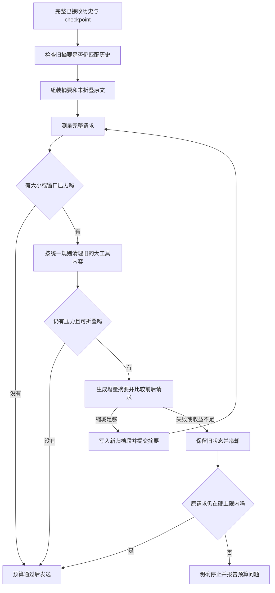

# 当前上下文规则与适配依据

本文以 2026-09-19 精简后的实现为准，面向普通主 Agent、同步子 Agent、CLI 和普通 Web 会话。本轮不开发或验收 Team。

参考材料为 `D:/agentcore2/AgentCore/docs/prompts/context-compression-porting.prompt.md`，来源核对基准为 `64f8d1c6`。参考材料用于理解设计；实现按本项目同步循环、Anthropic 风格消息和既有 SQLite checkpoint 调整，没有整体搬入来源架构。

## 1. 用日常语言理解

可以把它看成“完整档案 + 随身工作笔记”：完整档案保留已经收到的事实，模型每次只带这一步需要的工作笔记。

1. **内容还放得下，就继续带着。** 不再因为聊了几轮就花钱做摘要。
2. **快装满时，先整理旧的大块内容。** 比如已确认写成功的大段代码，只留文件身份和成功回执；需要细节时再读取。
3. **整理后还是太大，再写一份接续工作摘要。** 保留当前目标、有效限制、已经完成的证据和下一步。
4. **摘要写得不够短，就不换。** 原摘要和原历史仍在，不把“压缩反而变大”的结果提交。
5. **当前要求和最近的工作不随意概括。** 用户本轮原话保留，近期工具调用与结果成组保留。
6. **被移出的证据必须能解释怎么取回。** 没有归档的旧命令日志继续保留；不能为查看输出重跑有副作用的命令。
7. **停止、失败和恢复都先保住事实。** 取消后不提交迟到摘要；截断的工具参数不执行；失败不能写成成功。
8. **子任务有自己的笔记和计划。** 子 Agent 的摘要、归档读取器、compact 回调与内置 TODO 状态独立。

## 2. 一次请求如何处理

入口是 [Agent._create_message](../codeagent/agent.py) 与 [ContextManager](../codeagent/context/manager.py)。`Agent.messages` 保持权威历史，投影由其重新构建。不会把前一次有损视图重新当成原始数据。

这里“完整”指已经接收并完成生产端整理的历史。工具或外部服务在更早阶段已经截掉的内容不能凭空恢复；归档失败时也不会声称全文已经保存。

## 3. 触发与预算

| 项目 | 默认规则 |
| --- | --- |
| 请求软触发 | 完整序列化请求超过 300,000 字符 |
| 主请求硬限制 | 600,000 字符；软阈值高于硬限制时仍以硬限制保护 |
| 模型窗口压力 | 本次估算 prompt 加输出预留达到配置窗口的 80% |
| 模型窗口配置 | `CONTEXT_MODEL_WINDOWS_JSON` 按实际模型名映射，未命中用 `CONTEXT_WINDOW_TOKENS` |
| 窗口未知 | 值为 0 时只执行字符限制，不猜测厂商窗口 |
| 摘要输入硬限制 | 120,000 字符，包含摘要 system、旧摘要、消息及状态 |
| 摘要正文上限 | 12,000 字符，超出视为失败，不截断成半份摘要 |
| 摘要采纳条件 | 完整请求至少减少 `max(256, int(原请求字符数 × 5%))` 字符，且估算 prompt tokens 下降 |
| 失败／无收益冷却 | 90 秒，作用域与期限随 checkpoint 保存 |
| 摘要 I/O 超时 | 45 秒，非严格总墙钟期限 |
| 单次准备压缩上限 | 最多 3 个批次，无合法新区间时不再调用 |

`message_trigger_min_fold`、`round_trigger_min_fold` 及对应旧环境变量仅为兼容旧配置而接受，不再参与触发，也不再列入 `.env.example` 推荐配置。消息数仍用于保护窗口和批次边界：跨回合至少 12 条，执行内至少 2 个完整 assistant 轮；最小折叠 4 条，单批最多 200 条、执行内最多 12 轮。

[budget.py](../codeagent/context/budget.py) 分离“测量”和“验证”。无压力且不改视图时只测量一次完整请求；固定 system/tools/output 仅在需要整理时额外检查，避免对无法缩小的部分白做摘要。清理或摘要改变请求后才重新测量。

字符数针对稳定 JSON 表示，不是传输字节数。token 使用 UTF-8 字节数除以 2 向上取整，加每个媒体块 8,192 的预留，再加输出上限。这是启发式估算，不能保证上游一定接受。上一次请求的 usage 继续用于观测，不再单独触发当前已经变小的请求去压缩。

记忆选择和维护等辅助调用仍经 `BoundModelClient` 检查预算，fork 不丢检查；摘要采用自己的独立输入与窗口预算。

## 4. 统一的清理规则

[history.py](../codeagent/context/history.py) 不再因为用户开始下一回合就删掉旧工具 I/O 或附件。未覆盖历史继续原样参与请求，仅略过历史空 assistant 回复。需要整理时，统一交给 [projection.py](../codeagent/context/projection.py)。

- 仅在当前请求有压力时启用工具清理；短任务不为清理而清理。
- 旧调查结果默认达到 8,000 字符才考虑处理，调查保留最近 2 个候选执行组，命令保留最近 1 个。
- 失败、未完成或模糊配对、完整文件读取、未知工具保守保留。
- 命令没有可靠归档就保留结果。已有归档的结果只用实际路径，不猜文件位置、不重跑命令。
- 成功写入／编辑的正文默认达到 8,000 字符且离开最近 2 条 assistant 消息才考虑移出视图；失败写入保留原参数。
- 去掉多语言结构摘录，只留工具身份、状态和必要读取说明。
- 写入工具仍拒绝已知清理占位符作为整个正文，防止模型把注记当文件内容写回。
- 用户当前原文与补充独立保留；运行时提醒不当作新用户目标，也不重复钉在每次摘要后。

两个阶段有不同任务：生产端控制刚收到的巨大输出；请求端只在有压力时整理历史。生产端仍采用单结果 80,000／整批 200,000 字符预算，取消原来的 2,000 字符 bash 提前归档。没有达到生产限制的普通命令输出不额外包装或落盘。

重新读取文件得到的是当前内容，不保证等于过去版本；需要精确历史时读 transcript。清理会改变请求前缀，因此缓存收益必须用真实 usage 衡量。

## 5. 摘要、恢复与证据归档

摘要输入优先采用完整可见材料。最小合法批次也放不下时才生成带缺失标记的字段预览，保留调用 ID、路径和显式状态；隐藏推理、签名和媒体正文不作为摘要正文。摘要提示词将对话、工具和旧摘要视为数据，不能从中产生新权限或虚构成功。

候选摘要先在临时状态上构建完整请求并检查缩减，通过后才写归档、提交摘要和覆盖水位。无收益时旧摘要、水位和归档索引不变，进入冷却，避免每次请求重复付费尝试。

现有摘要仍结合当前任务／运行状态，因此保留覆盖前缀及完整来源快照校验。该第二份校验有明确依赖，不能在仍混入当前状态时直接删除。编辑或回滚相关历史会使摘要失效；单纯追加不会。把“当前状态”进一步移出历史摘要属于后续职责调整，本轮没有为精简强行移除保护。

锁只保护单个 ContextManager；跨实例归属由现有运行调度和 checkpoint 负责，不宣称分布式 CAS。摘要调用前、返回后和归档后检查取消；失败不推进水位。冷却从持久的墙钟截止时间恢复为单调时钟期限，模型／凭据作用域变更不继承旧冷却。

### 增量归档

首份归档保存当次覆盖的消息，后续只保存新覆盖区间。新 `.jsonl` 的第一行记录版本、上一段文件名和 `[start,end)` 范围，后面是本批消息。文件名包含随机唯一部分，以排他方式新建，避免 Windows 同一时钟刻度或两个恢复分支覆盖已有文件。

`load_context_history` 从摘要给出的最新路径向前读取分段，向模型呈现连续消息编号，不把段头当成对话。各段不可变，旧 checkpoint 的路径只能读到当时已覆盖范围；两个分支可以共享旧段，分别增加各自新段。

所有链接都按当前执行者的私有根目录校验，拒绝越界、链接／junction、循环或不一致区间。旧版普通 JSONL 仍可直接读取。旧归档缺失或位于不适合链接的旧布局时，从仍在 canonical 中的已覆盖原文重新建立首段；不会猜测缺失内容。

归档后取消可能留下未引用的孤立段，不影响已提交状态。没有新增数据库表、索引服务或自动清理服务。归档各段相互引用，不能单独删除仍被后续段引用的文件。旧版读取器不认识新分段链，代码回退需要同步考虑读取器版本。

### 分页与隔离

[LoadContextHistoryTool](../codeagent/tools/runtime_data.py) 的 `message_offset` 从 1 开始，`message_limit` 默认 3、最多 10；`char_offset` 从 0 开始，`char_limit` 默认 2,000、最多 4,000。字符位置针对原始 JSON 行，片段不一定是完整 JSON。新归档段头不计入消息编号。

`load_tool_output` 按 `offset`／`limit` 读取文本行，增加 `char_offset`／`char_limit` 可读超长单行中部；正文最多 12,000 字符。两个读取器整份响应均不超过 16,000 字符，并流式扫描大行，不一次分配整行正文。定位仍可能扫描较多记录，并非随机访问数据库。

CLI、Web 和默认 SDK 子 Agent 的 ContextManager、目录、compact 回调、内置 TODO 工具和提醒计数独立。自定义有状态工具／hook 仍应由调用者的环境工厂正确构建，不声称任意自定义对象都自动隔离。

`max_tokens` 截断响应中的工具调用不执行。合法 ID 补明确“未执行、参数可能不完整”的结果；无效调用只保存为惰性数据。次数耗尽明确失败，只有后续重新提交的完整调用才能执行，保持 checkpoint 可保存和恢复。

## 6. 这次删减了什么，保留了什么

| 原行为 | 现在 |
| --- | --- |
| 消息数／轮数到门槛就摘要 | 仅大小或窗口压力自动触发 |
| 合法摘要直接提交 | 检查完整请求净缩减后提交 |
| 下一用户回合独立裁剪工具证据 | 保留未摘要证据，统一按压力清理 |
| 500 字写参、1 条 assistant 保留 | 默认 8,000 字、2 条 assistant 保留 |
| 多语言启发式结构摘录 | 移除 |
| 2,000 字命令提前归档 | 移除，按已有生产端大输出预算处理 |
| 每次写整个已覆盖前缀 | 不可变增量段，共享此前归档 |
| 无改动请求重复计算完整预算 | 测量一次并复用验证 |
| 观察器反复计算上一份历史哈希 | 复用已保存的上一份哈希 |

保留原始历史、当前输入和工具组保护、完整预算、超大摘要兜底、失败冷却、取消检查、来源校验及子 Agent 隔离。技能／长期记忆继续走原有按需加载流程，实时摘要不自动写成长期偏好。

未引入来源后台会话服务、另一套数据库摘要仓库、分布式锁、浏览器快照处理、Team 成果传递、水位 DAG、water-filling、动态工具发现或新的 memory episode 管线。

## 7. 验证与限制

2026-09-19 最终非 Team 回归共 419 项，417 项通过、2 项跳过、0 失败，耗时 15.712 秒。发现 `tests` 下 unittest 后排除测试 ID 中包含 `test_team` 的用例。当前工作区日志为 `tmp/context-nonteam-tests.log`；相关已跟踪文件的 `git diff --check` 通过。

新增 14 项行为测试位于 [test_context_simplification.py](../tests/test_context_simplification.py)，覆盖小上下文不调用摘要、45 轮默认短任务无摘要、预算测量次数、跨回合证据保留、无收益摘要拒绝与冷却、大写参清理、跨段回查、恢复分支隔离和相同时钟刻度防覆盖。既有长任务测试改为显式配置压力阈值，继续验证多次滚动摘要及第 22 轮 checkpoint 恢复。

两项跳过测试为 `ContextHistoryToolTests.test_symlink_is_denied_even_when_target_is_inside_root`、`WorkspaceGuardTests.test_rejects_symlink_escape`，原因是当前 Windows 进程缺少创建符号链接的权限（WinError 1314）。路径越界与模拟链接／reparse 检查仍有通过的用例。既有 Starlette 422 常量弃用警告不影响结果。

旧的“28 条短消息必须压缩”“下一回合必须去掉工具 I/O”等断言已按新规则调整；不能把删除旧行为的测试当成新收益评测。

尚未调用真实模型做摘要语义保真、费用、前缀缓存或任务成功率对照实验。token 是估算，清理阈值是保守默认值，不是实证最优值。完整历史仍会增长；本轮消除了重复前缀归档，没有解决长期保留期和所有扫描成本。

主开关 `CONTEXT_COMPACT_MODE=off` 关闭模型摘要，预算和独立的压力型工具清理仍有效；`CONTEXT_TOOL_PROJECTION_ENABLED=false` 可关闭后者。关闭不会删除已有状态或归档。实际配置见 [.env.example](../.env.example) 与 [ContextConfig](../codeagent/context/models.py)。
